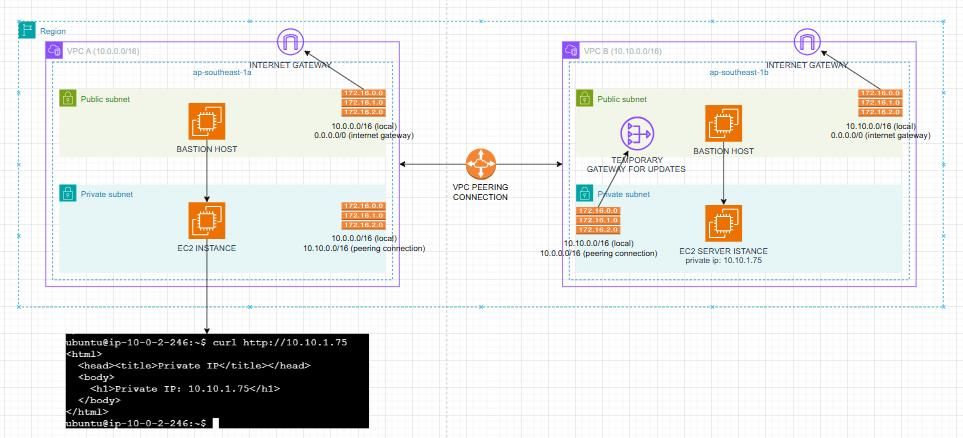

# AWS Multi-VPC Peering & Network Segmentation


## 📖 Project Overview
This project demonstrates a secure, modular AWS network architecture designed to simulate a production-grade environment. It features two isolated Virtual Private Clouds (VPCs) located in different Availability Zones (AZs) within the `ap-southeast` region.

The core objective was to establish secure, private communication between an **EC2 Client** in VPC A and an **EC2 Web Server** in VPC B using **VPC Peering**. The architecture ensures that sensitive data traffic never traverses the public internet, while simultaneously allowing the private server to securely access the internet for OS updates via a NAT Gateway.

## 🏗 Architecture


*Figure 1: Network topology showing Subnets, Route Tables, Peering Connections, and Gateways.*

### Infrastructure Breakdown

**1. VPC A (Client Network)**
* **CIDR:** `10.0.0.0/16`
* **Availability Zone:** `ap-southeast-1a`
* **Public Subnet:** Hosts a Bastion Host for secure SSH access into the private network.
* **Private Subnet:** Hosts the Client EC2 instance. This instance has no direct internet access and relies on the Bastion for management and the VPC Peering connection for internal data transfer.

**2. VPC B (Server Network)**
* **CIDR:** `10.10.0.0/16`
* **Availability Zone:** `ap-southeast-1b`
* **Public Subnet:**
    * **Bastion Host:** For secure administrative access.
    * **NAT Gateway (Temporary):** Provisioned specifically to allow the private EC2 instance to download OS updates and patches without exposing the instance to inbound traffic.
* **Private Subnet:** Hosts the internal Web Server (`10.10.1.75`).

**3. Connectivity & Routing**
* **VPC Peering:** A direct, non-transitive network connection established between VPC A and VPC B.
* **Route Tables:**
    * **Peering Routes:** Traffic destined for the peer VPC is routed explicitly through the Peering Connection (`pcx`).
    * **NAT Routes (VPC B):** Outbound internet traffic (`0.0.0.0/0`) from the private subnet is routed to the NAT Gateway.
* **Internet Gateways:** Attached to both VPCs to facilitate Bastion access and NAT Gateway traffic.

## 🛠 Technologies Used
* **AWS VPC:** Network isolation and segmentation.
* **EC2 (Ubuntu Linux):** Compute resources for client and server instances.
* **VPC Peering:** Cross-network private connectivity.
* **NAT Gateway:** Secure outbound internet access for private subnets.
* **Route Tables:** Granular traffic engineering.
* **Security Groups:** Stateful instance-level firewalls.
* **Bash/cURL:** For connectivity testing and validation.

## 🚀 Implementation Steps

### Step 1: Network Design & Subnetting
* Created two distinct VPCs with non-overlapping CIDR blocks (`10.0.0.0/16` and `10.10.0.0/16`) to ensure successful peering.
* Partitioned each VPC into **Public** and **Private** subnets.

### Step 2: Security Configuration
* Deployed **Bastion Hosts** in the public subnets to act as "jump boxes."
* Configured **Security Groups**:
    * *Bastion:* Allowed SSH (22) strictly from my IP address.
    * *Private Instances:* Allowed SSH (22) only from the Bastion Security Group; Allowed HTTP (80) and ICMP only from the Peer VPC CIDR.

### Step 3: NAT Configuration (VPC B)
* Deployed a **NAT Gateway** in the Public Subnet of VPC B.
* Updated the Private Subnet's route table in VPC B to direct internet traffic (`0.0.0.0/0`) to the NAT Gateway, allowing the server to run `apt update` securely.

### Step 4: Peering Configuration
1.  Initiated a Peering Request from VPC A to VPC B.
2.  Accepted the request in VPC B.
3.  **Crucial Step:** Updated the Route Tables associated with the *Private Subnets* to route cross-VPC traffic via the peering connection (`pcx-xxxxxxxxx`).

## ✅ Validation & Testing
To verify the architecture, I performed a connectivity test from the Client EC2 in VPC A to the Server EC2 in VPC B.

**Test Scenario:**
Attempt to retrieve data from the Private Server (`10.10.1.75`) using the Private Client (`10.0.2.246`).

**Result:**
As seen in the terminal output below, the request was successful:

```bash
ubuntu@ip-10-0-2-246:~$ curl [http://10.10.1.75](http://10.10.1.75)
<html>
<head><title>Private IP</title></head>
<body>
<h1>Private IP: 10.10.1.75</h1>
</body>
</html>
